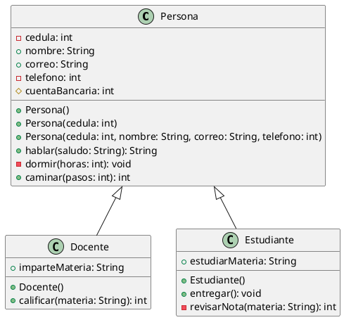
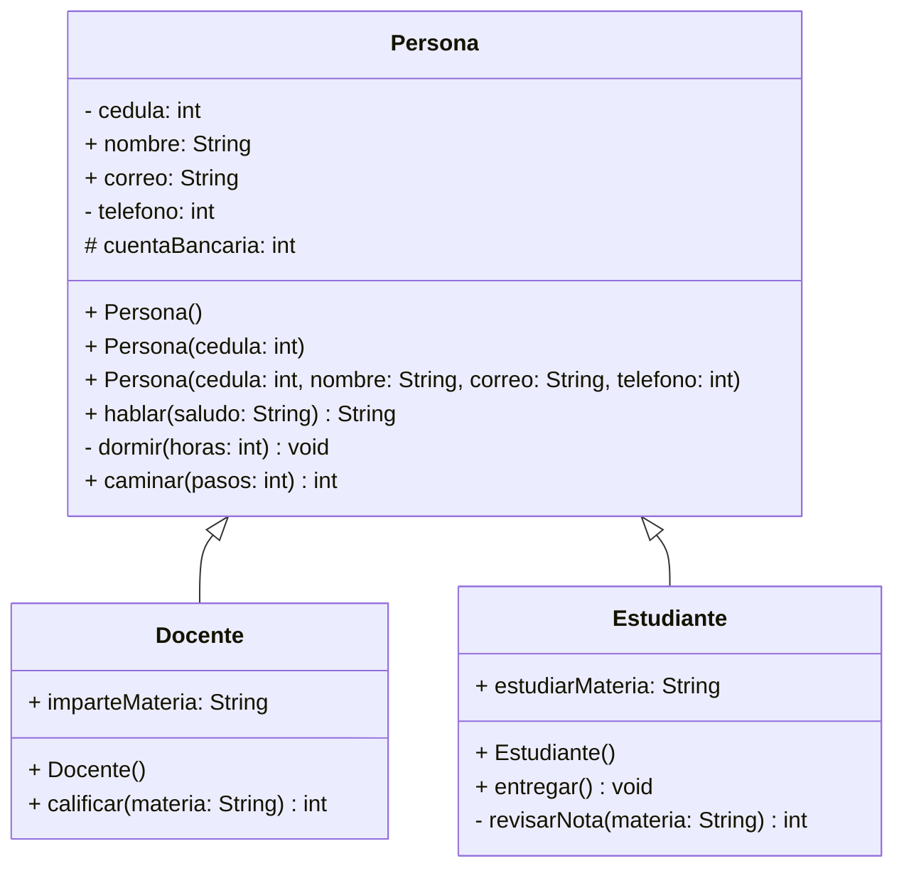

# Demo 412

## Modificadores de Acceso

Los modificadores de acceso en Java controlan la visibilidad de los atributos y métodos de una clase:

| Modificador | Símbolo | Descripción |
|-----------|---------|-------------|
| **Private** | `-` | Solo se puede acceder desde la clase donde se declaró el atributo o método |
| **Public** | `+` | Se puede acceder desde cualquier clase |
| **Protected** | `#` | Se puede acceder desde la clase donde se declaró el atributo, método y desde las clases que hereden de ella |

## Palabras Reservadas

- **`this`** => Apunta a la misma clase o referencia a la misma clase
- **`new`** => Nos permite crear un objeto de una clase
- **`void`** => Nos permite indicar que no retorna un valor
- **`class`** => Nos permite crear una clase
- **`constructor`** => Método inicial que se ejecuta cuando creamos un objeto de una clase

## Clase Persona

La clase `Persona` es una clase que demuestra el uso de modificadores de acceso y constructores en Java.

### Atributos

```java
private int cedula;           // Solo accesible dentro de la clase
public String nombre;         // Accesible desde cualquier clase
public String correo;         // Accesible desde cualquier clase
private int telefono;         // Solo accesible dentro de la clase
protected int cuentaBancoria; // Accesible en clases derivadas
```

### Constructores

La clase cuenta con 3 constructores sobrecargados:

1. **Constructor vacío**: `Persona()`
   - No recibe parámetros
   - Imprime: "Constructor vacio"

2. **Constructor con un parámetro**: `Persona(int cedula)`
   - Recibe la cédula como parámetro
   - Imprime: "Constructor con parametro cedula"

3. **Constructor completo**: `Persona(int cedula, String nombre, String correo, int telefono)`
   - Recibe todos los parámetros necesarios
   - Inicializa todos los atributos
   - Imprime: "Constructor con parametros cedula, nombre, correo y telefono"

### Métodos

| Modificador | Método | Descripción |
|-----------|--------|-------------|
| `public` | `hablar(String saludo): String` | Retorna un saludo procesado |
| `private` | `dormir(int horas): void` | Imprime las horas que duerme la persona |
| `public` | `caminar(int pasos): int` | Retorna la cantidad de pasos caminados |

## Diagrama de Clases UML (PlantUML)



## Diagrama de Clases (Mermaid)



## Descripción
- **Persona**: Clase base con atributos y métodos comunes
- **Docente**: Hereda de Persona, agrega funcionalidad de calificación
- **Estudiante**: Hereda de Persona, agrega funcionalidad de entrega de tareas